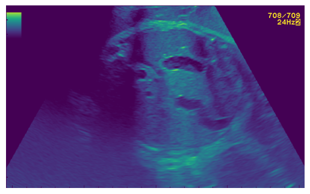
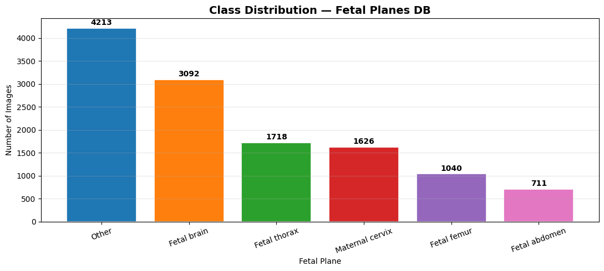
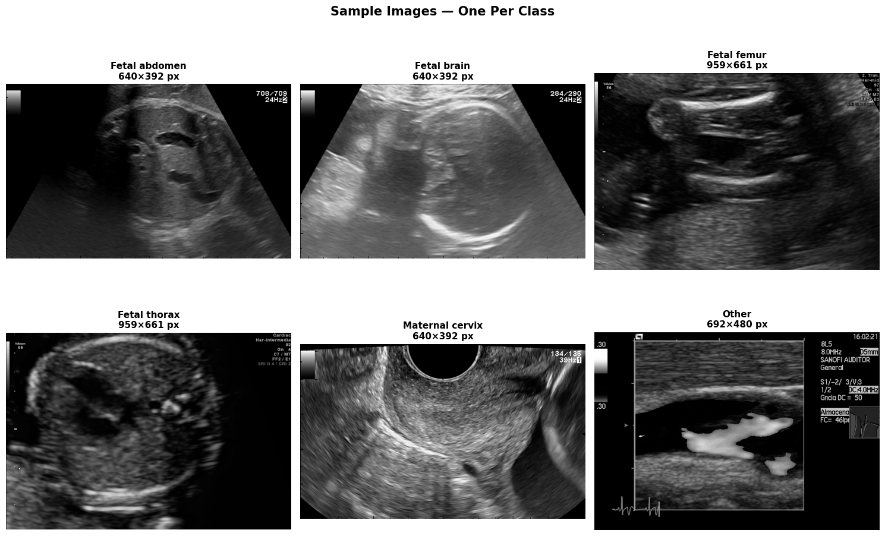
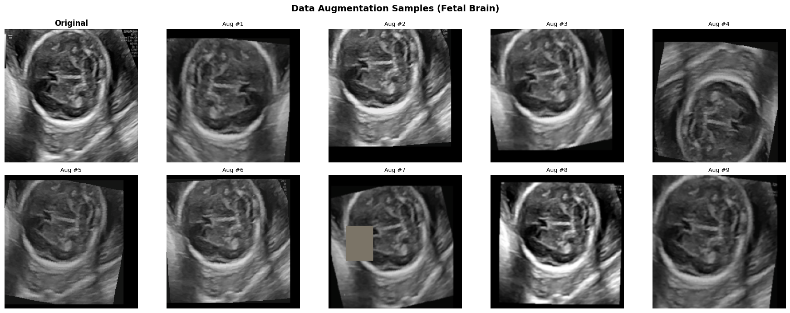
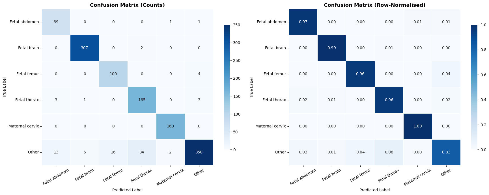
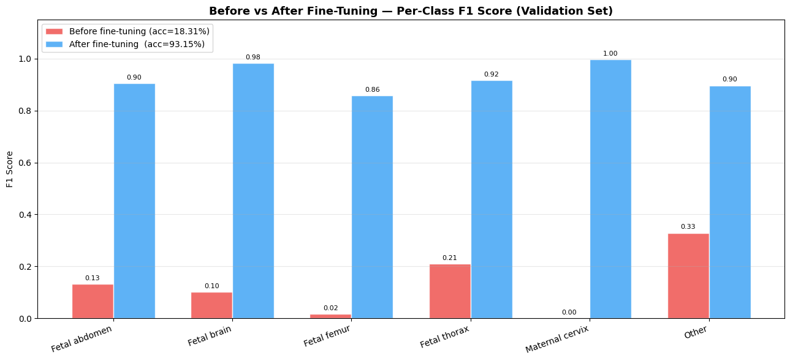

# EfficientNet-B3 Output Data & Visualizations

This report contains all the visual outputs and important evaluation metrics extracted directly from the `EfficienetB3.ipynb` notebook.

## Class Distribution


## Sample Images Grid


## Training and Validation Curves


## Confusion Matrix


## Before vs After Fine-Tuning Performance


## Grad-CAM Saliency Maps


## Classification Report Matrix
```text

🎯 Test Accuracy : 0.9306 (93.06%)

📋 Per-class Classification Report:
──────────────────────────────────────────────────────────────────────
                 precision    recall  f1-score   support

  Fetal abdomen     0.8118    0.9718    0.8846        71
    Fetal brain     0.9777    0.9935    0.9856       309
    Fetal femur     0.8621    0.9615    0.9091       104
   Fetal thorax     0.8209    0.9593    0.8847       172
Maternal cervix     0.9819    1.0000    0.9909       163
          Other     0.9777    0.8314    0.8986       421

       accuracy                         0.9306      1240
      macro avg     0.9053    0.9529    0.9256      1240
   weighted avg     0.9373    0.9306    0.9305      1240

✅ Saved: classification_report.csv

```

## Extracted Plot 7


## Extracted Plot 8


## Extracted Plot 9


