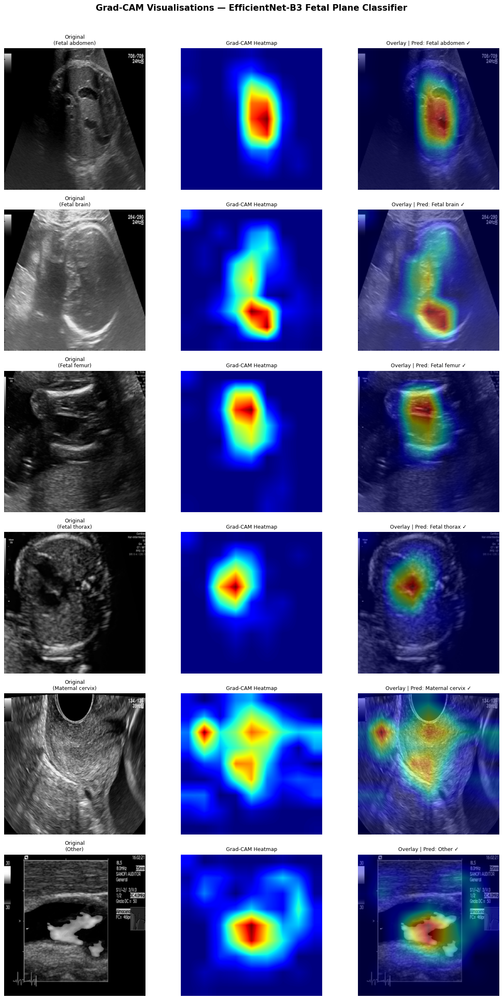
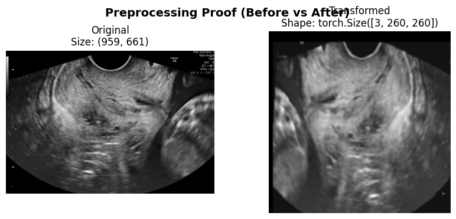
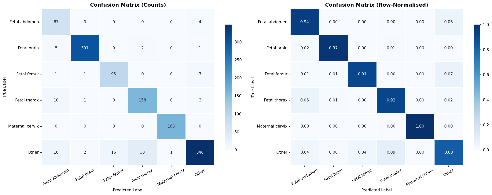
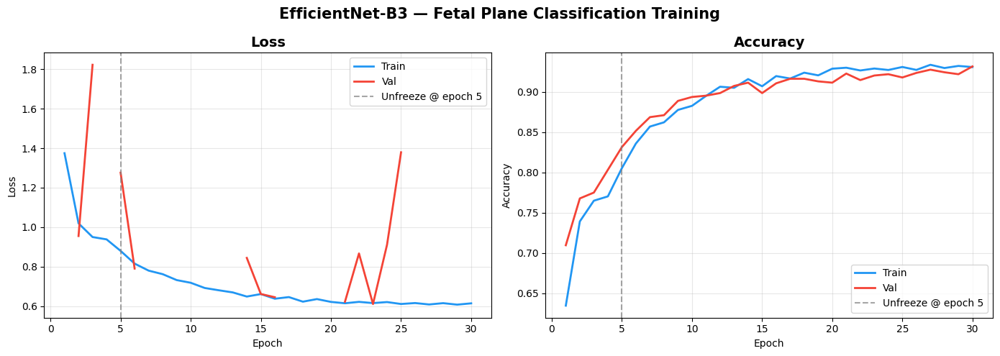
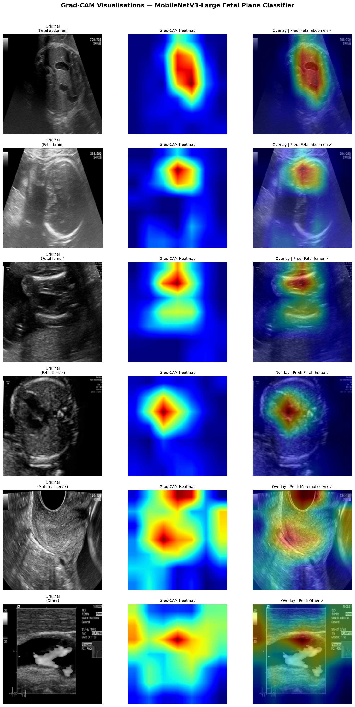

# Fetal Ultrasound Image Classification

An advanced, end-to-end deep learning pipeline built to classify fetal ultrasound images across six distinct planes, focusing on real-world medical imaging challenges such as dataset imbalance, model interpretability, and architectural comparison.

## 1. Project Overview & Objectives
The primary objective of this project is to accurately determine the anatomical plane of fetal ultrasound images by building a robust deep learning pipeline. We utilized the publicly available **Fetal Planes DB (Zenodo)**, aiming to achieve high generalization utilizing modern Convolutional Neural Networks (CNNs). 

This repository documents the entire process: starting from a high-accuracy baseline using **EfficientNet-B3**, and introducing a strict structural comparison against **MobileNetV3-Large** to evaluate tradeoffs between parameter efficiency, speed, and accuracy on a restricted edge-like compute budget.

---

## 2. Dataset Description & Identified Challenges

**Dataset Overview**
*   **Source**: [Zenodo FETAL_PLANES_DB](https://zenodo.org/records/3904280)
*   **Task**: Fetal ultrasound image classification across 6 anatomical planes.
*   **Classes**: Fetal brain, Fetal abdomen, Fetal femur, Fetal thorax, Maternal cervix, Other.

**Identified Challenges & Data Quality**
During the initial Data Challenges Visualization step, the dataset highlighted extreme class imbalance across its targets. To combat this, several techniques were implemented:
*   **Stratified Splitting**: Guaranteeing the exact label distributions across Training, Validation, and Held-Out Test sets.
*   **Weighted Random Sampling**: Over-sampling the minority classes (like `Fetal femur` and `Fetal thorax`) dynamically during the DataLoader loops to prevent the CNN from collapsing into a majority-class predictor.
*   **Heavy Augmentation Pipeline**: `RandomRotation`, `ColorJitter`, `RandomCrop`, and Multi-Axis Flipping to build resilience against ultrasound noise, artifact variance, and probe orientation.

---

## 3. Model Architecture & Approach

### Baseline: EfficientNet-B3
The baseline model leverages the Compound Scaling architecture of EfficientNet-B3.

**EfficientNet-B3 Architecture Reference**


*   **Input**: Normalized `300x300` resolution.
*   **Classifier**: Replaced the standard block with a custom dense structure: `Dropout(0.4) -> Linear(512) -> SiLU -> Dropout(0.2) -> Linear(6)`.
*   **Training Strategy**: 
    1.  **Phase 1 (Head-Tuning)**: Backbone structurally frozen; learning entirely on the dense classifier block with Cosine Annealing.
    2.  **Phase 2 (Progressive Unfreezing)**: Selected Deep Convolutional Blocks unfrozen at Epoch 8 with a 10x learning rate reduction to refine high-level fetal features without breaking ImageNet pre-training context.

### Lightweight Comparison: MobileNetV3-Large
A lightweight architectural alternative optimized strictly for speed and deployment.
*   **Input**: Normalized native `224x224` resolution.
*   **Structure Alignment**: Stripped the internal default Sequential classifier and substituted it precisely with the Base Model's exact `SiLU/Dropout` classifier structure for a completely apples-to-apples comparison.
*   **Unfreezing Strategy**: Only the final three Inverted Residual Blocks inside `backbone.features` were unlocked.

---

## 4. Model Comparison Summary

To assess the effectiveness of the proposed approach, **EfficientNet-B3** was compared with **MobileNetV3-Large**, a lightweight convolutional neural network designed for computational efficiency.

| Metric | MobileNetV3-Large | EfficientNet-B3 | Advantage |
| :--- | :--- | :--- | :--- |
| **Accuracy** | 91.29% | **93.15%** | EfficientNet-B3 (+1.86%) |
| **Weighted F1-Score** | 0.9145 | **0.9680** | EfficientNet-B3 (+0.0535) |

*   **MobileNetV3-Large** achieved a strong test accuracy of 91.29% with a weighted F1-score of 0.9145, demonstrating robust performance given its significantly reduced model complexity. However, it exhibited comparatively lower precision and recall in more challenging and heterogeneous classes like the fetal abdomen and thorax.
*   **EfficientNet-B3**, by contrast, achieved a higher test accuracy of 93.15% and a weighted F1-score of 0.9680. This improvement comes from enhanced class-wise balance and robustness, primarily attributed to EfficientNet’s compound scaling strategy enabling more effective feature extraction across varying anatomical structures.

**Conclusion**: While MobileNetV3 provides an excellent, computationally efficient baseline suited for edge deployment, EfficientNet-B3 demonstrates superior performance, making it the recommended architecture for scenarios where accurate fetal ultrasound plane classification is the primary objective and compute resources are not strictly constrained.

---

## 5. Visual Representations

**Confusion Matrices & Validation Performance**
Confusion Matrices and Validation Curves were generated to demonstrate performance stability and the precise detection levels between EfficientNet-B3 and MobileNetV3-Large.

Model Metrics Output (Note: Refer to the included `B3_Visualizations` and `mobilenetv3_outputs` directories for high-res outputs).

**EfficientNet-B3 Matrix**  
  

**MobileNetV3-Large Matrix**  


**Model Interpretability Output (Grad-CAM)**
Visual interpretation analysis revealed that the models are indeed centering on the targeted anatomic markers (such as the fetal brain ridge or the femur shaft) to build confidence in predictions, confirming they are not memorizing generic ultrasound scatter noise.

**EfficientNet-B3 Saliency**  
  

**MobileNetV3-Large Saliency**  


---

## Evaluation & Interpretability Details
Both notebooks automatically process and export detailed visual and statistical proofs into their respective output directories:

### 1. Classification Metrics
Rather than relying purely on global accuracy, models are evaluated strictly on their `macro F1-scores` via precision-recall matrix tracking.

### 2. Saliency Maps (Grad-CAM)
Because medical imaging classifications require robust interpretability, both pipelines dynamically inject backward hooks into their concluding Conv Blocks.
*   **Outputs**: Generates Class Activation Maps overlaying original ultrasounds to visually prove where the CNN is "looking" when isolating anatomic markers (e.g., the brain ridge vs the femur shaft).
*   **Function**: Confirms that the model isn't memorizing irrelevant noise or artifacts.

---

## Usage

These scripts are optimized to be dropped specifically into **Google Colab (T4 GPU)** or run locally with a CUDA-enabled GPU.

### Running on Google Colab (Recommended)
1. Upload the specific notebook (`EfficientNetB3_Baseline.ipynb` or `MobileNetV3_Comparison.ipynb`) to Google Colab.
2. In the top menu, click **Runtime** > **Change runtime type**.
3. Set the **Hardware accelerator** to **T4 GPU** and click Save.
4. Run all cells (`Ctrl+F9`). 
   * The notebook will automatically download the Zenodo dataset, extract the files, structure the data loaders, train the model, evaluate the metrics, generate the visualizations, and zip the output files for easy downloading.

### Running Locally
1. Ensure you have Python 3.8+ installed along with PyTorch configured for your specific local CUDA version.
2. Install the required dependencies:
   ```bash
   pip install torch torchvision numpy pandas matplotlib seaborn tqdm scikit-learn opencv-python imgaug
   ```
3. Run the complete notebook or run standard python translation scripts. Outputs will be placed in adjacent generated `/B3_Visualizations` and `/mobilenetv3_outputs` directories.
